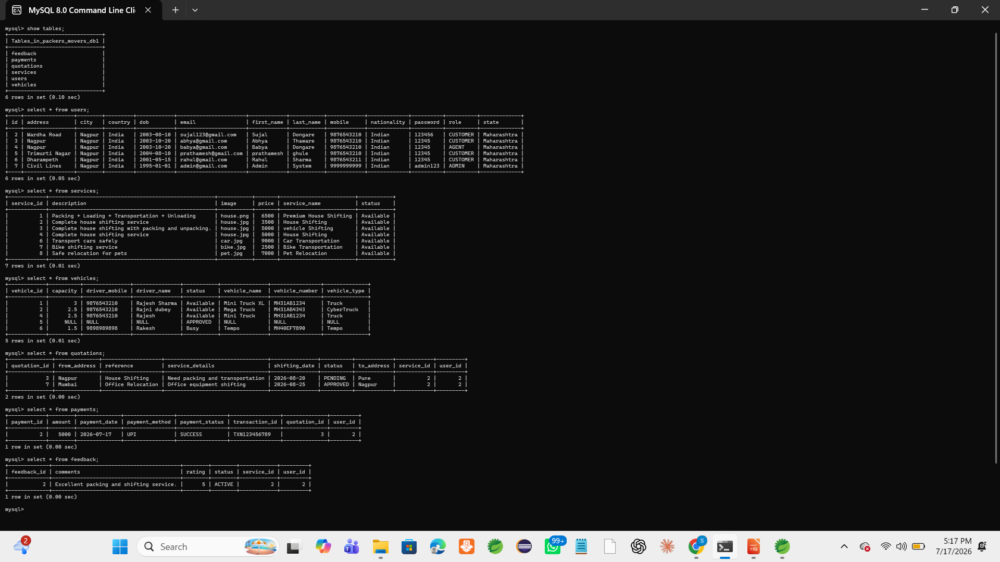
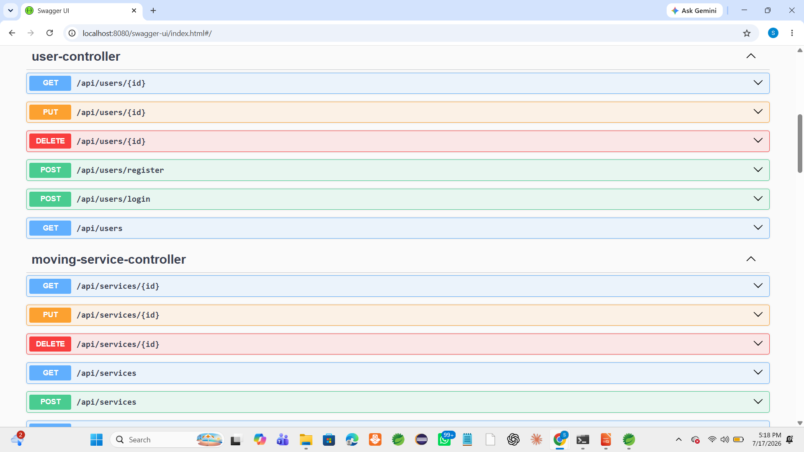
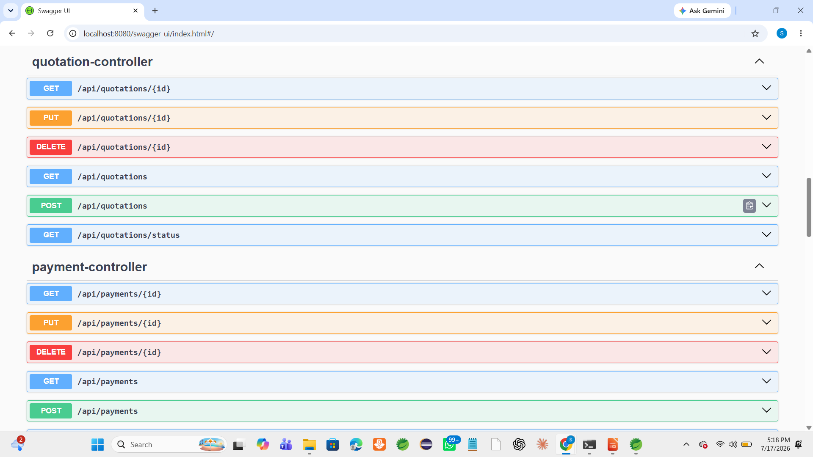
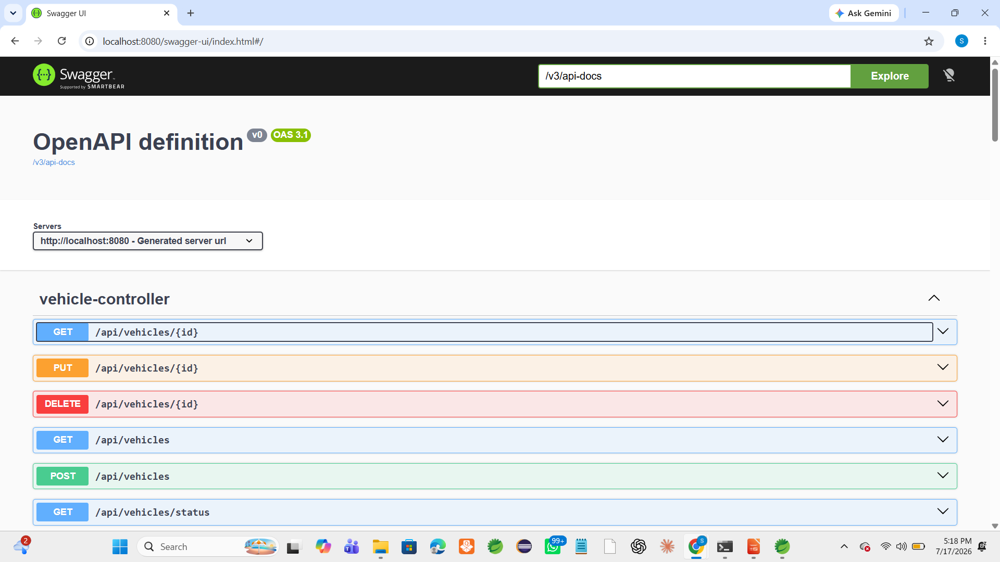
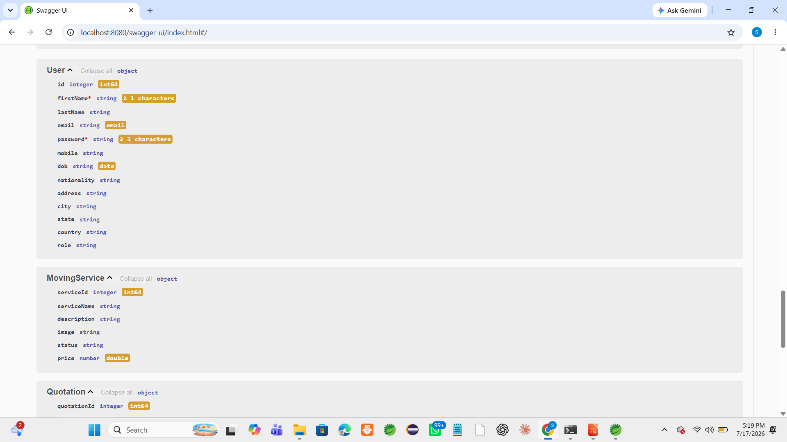
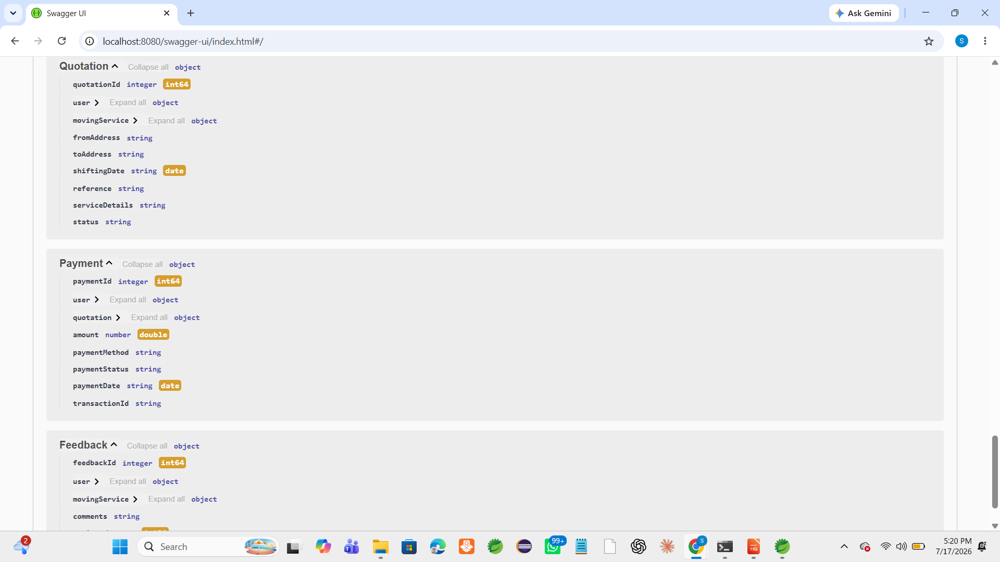

# 🚚 Packers & Movers Management System

A comprehensive **Spring Boot REST API** for managing packers and movers services, including user management, service quotations, vehicle management, and payment processing.


## 📌 Project Overview

The Packers & Movers Management System is a backend application developed using Spring Boot. It provides RESTful APIs for managing users, moving services, quotations, vehicles, payments, and customer feedback.

This project follows a layered architecture using Controller, Service, Repository, and Entity layers. APIs are tested using Postman and documented with Swagger UI.

---

## ✨ Features

- User Registration & Login
- User Management (CRUD)
- Moving Service Management
- Vehicle Management
- Quotation Management
- Payment Management
- Customer Feedback Management
- Swagger API Documentation
- MySQL Database Integration
- RESTful API Design
- Layered Architecture

---

## 📂 Modules

- 👤 User Module
- 🚛 Moving Service Module
- 📋 Quotation Module
- 🚚 Vehicle Module
- 💳 Payment Module
- ⭐ Feedback Module

---

## 📊 Total APIs

| Module | APIs |
|---------|------|
| User | 6 |
| Moving Service | 6 |
| Quotation | 6 |
| Vehicle | 6 |
| Payment | 6 |
| Feedback | 6 |

**Total APIs : 36**

---

## 📖 Swagger

```
http://localhost:8080/swagger-ui/index.html
```

---

## 🧪 API Testing

All APIs have been tested using:

- Swagger UI
- Postman
---

## 📸 Screenshots

### 1. Database Tables (MySQL)
All tables with sample data showing the complete database structure:



**Tables visible:**
- **users** - User registration and profile data
- **services** - Moving services available
- **vehicles** - Fleet management data
- **quotations** - Customer quotation requests
- **payments** - Payment transactions
- **feedback** - Customer feedback and ratings

### 2. Swagger UI - User & Service Controllers
Complete API endpoints for User and Moving Service management:



**Available Endpoints:**
- `POST /api/users/register` - User registration
- `POST /api/users/login` - User login
- `GET /api/users` - Get all users
- `GET /api/users/{id}` - Get user by ID
- `PUT /api/users/{id}` - Update user
- `DELETE /api/users/{id}` - Delete user
- `GET /api/services` - Get all services
- `POST /api/services` - Create service
- `GET /api/services/{id}` - Get service by ID
- `PUT /api/services/{id}` - Update service
- `DELETE /api/services/{id}` - Delete service

### 3. Swagger UI - Quotation & Payment Controllers
API endpoints for quotations and payment processing:



**Available Endpoints:**
- `GET /api/quotations/{id}` - Get quotation by ID
- `PUT /api/quotations/{id}` - Update quotation
- `DELETE /api/quotations/{id}` - Delete quotation
- `GET /api/quotations` - Get all quotations
- `POST /api/quotations` - Create quotation
- `GET /api/quotations/status` - Get quotations by status
- `GET /api/payments/{id}` - Get payment by ID
- `PUT /api/payments/{id}` - Update payment
- `DELETE /api/payments/{id}` - Delete payment
- `GET /api/payments` - Get all payments
- `POST /api/payments` - Process payment

### 4. Swagger UI - Vehicle & Feedback Controllers
API endpoints for vehicle management and feedback:



**Available Endpoints:**
- `GET /api/vehicles/{id}` - Get vehicle by ID
- `PUT /api/vehicles/{id}` - Update vehicle
- `DELETE /api/vehicles/{id}` - Delete vehicle
- `GET /api/vehicles` - Get all vehicles
- `POST /api/vehicles` - Add new vehicle
- `GET /api/vehicles/status` - Filter vehicles by status
- `GET /api/feedback/{id}` - Get feedback by ID
- `PUT /api/feedback/{id}` - Update feedback
- `DELETE /api/feedback/{id}` - Delete feedback
- `GET /api/feedback` - Get all feedback
- `POST /api/feedback` - Submit feedback
- `GET /api/feedback/rating` - Get feedback by rating

### 5. Swagger UI - API Schemas
Data models and schemas for all entities:



**Entities Documented:**
- **User** - id, firstName, lastName, email, password, mobile, dob, nationality, address, city, state, country, role
- **MovingService** - serviceId, serviceName, description, image, status, price
- **Quotation** - quotationId, user, movingService, fromAddress, toAddress, shiftingDate, reference, serviceDetails, status
- **Payment** - paymentId, user, quotation, amount, paymentMethod, paymentStatus, paymentDate, transactionId
- **Vehicle** - vehicleId, vehicleName, vehicleNumber, vehicleType, capacity, driverName, driverMobile, status
- **Feedback** - feedbackId, user, movingService, comments, rating, status

### 6. Swagger UI - Complete Schemas
Detailed schema definitions showing field types and constraints:



### Swagger UI Access
Interactive API documentation available at:
```
http://localhost:8080/swagger-ui.html
```

**Try it out:** Use the Swagger UI to test all endpoints directly from your browser!

---

## 🏗️ Architecture Diagram

```
┌─────────────────────────────────────────────────────────────┐
│                     CLIENT LAYER                             │
│                  (REST API Consumers)                        │
└──────────────────────┬──────────────────────────────────────┘
                       │
┌──────────────────────▼──────────────────────────────────────┐
│                  CONTROLLER LAYER                            │
│  ┌──────────────────────────────────────────────────────┐   │
│  │ UserController │ ServiceController │ QuotationCtrl   │   │
│  │ PaymentController │ VehicleController │ FeedbackCtrl │   │
│  └──────────────────────────────────────────────────────┘   │
└──────────────────────┬──────────────────────────────────────┘
                       │
┌──────────────────────▼──────────────────────────────────────┐
│                   SERVICE LAYER                              │
│  ┌──────────────────────────────────────────────────────┐   │
│  │ UserServiceImpl │ MovingServiceImpl │ QuotationImpl    │   │
│  │ PaymentServiceImpl │ VehicleServiceImpl │ FeedbackImpl │   │
│  └──────────────────────────────────────────────────────┘   │
└──────────────────────┬──────────────────────────────────────┘
                       │
┌──────────────────────▼──────────────────────────────────────┐
│               REPOSITORY LAYER (DAO)                         │
│  ┌──────────────────────────────────────────────────────┐   │
│  │ UserRepository │ ServiceRepository │ QuotationRepo   │   │
│  │ PaymentRepository │ VehicleRepository │ FeedbackRepo │   │
│  └──────────────────────────────────────────────────────┘   │
└──────────────────────┬──────────────────────────────────────┘
                       │
┌──────────────────────▼──────────────────────────────────────┐
│              DATABASE LAYER (JPA/Hibernate)                  │
│                  MySQL Database                              │
│          (packers_movers_db1)                               │
└─────────────────────────────────────────────────────────────┘

Exception Handling:
┌──────────────────────────────────────┐
│   GlobalExceptionHandler             │
│  - Custom Error Responses            │
│  - HTTP Status Codes                 │
│  - Error Messages                    │
└──────────────────────────────────────┘
```

---

## 🗄️ Database ER Diagram

```
┌──────────────────┐
│     USERS        │
├──────────────────┤
│ id (PK)          │
│ firstName        │
│ lastName         │
│ email (UNIQUE)   │
│ password         │
│ mobile           │
│ dob              │
│ nationality      │
│ address          │
│ city             │
│ state            │
│ country          │
│ role             │
└────────┬─────────┘
         │
    ┌────┴────┬─────────────────┐
    │          │                 │
    │          │                 │
┌───▼───┐  ┌──▼────────────┐  ┌─▼────────────┐
│QUOTA- │  │   PAYMENTS    │  │   FEEDBACK   │
│TIONS  │  ├───────────────┤  ├──────────────┤
├───────┤  │ paymentId(PK) │  │feedbackId(PK)│
│quotId │  │ user_id (FK)  │  │user_id (FK)  │
│user_id├─▶│quot_id (FK)   │  │rating        │
│service├─▶│amount         │  │comment       │
│_id(FK)│  │paymentMethod  │  │createdDate   │
│from   │  │paymentStatus  │  └──────────────┘
│address│  │transactionId  │
│to     │  │paymentDate    │
│address│  └───────────────┘
│shift  │
│date   │
│status │
└───────┘
   │
   └─────┬──────────┐
         │          │
    ┌────▼────┐ ┌──▼──────────┐
    │SERVICES │ │  VEHICLES   │
    ├─────────┤ ├─────────────┤
    │serviceId│ │vehicleId(PK)│
    │name     │ │type         │
    │desc     │ │model        │
    │image    │ │capacity     │
    │price    │ │status       │
    │status   │ │registration│
    └─────────┘ │details      │
                └─────────────┘

```

**Relationships:**
- **1:N** - User has many Quotations
- **1:N** - User has many Payments
- **1:N** - User has many Feedbacks
- **1:N** - MovingService has many Quotations
- **1:N** - Quotation has many Payments
- **N:1** - Payment belongs to one User and one Quotation

---

## 📚 API Documentation

### Authentication & User Management

#### 1. **Register User**
```http
POST /api/users/register
Content-Type: application/json

{
  "firstName": "John",
  "lastName": "Doe",
  "email": "john.doe@example.com",
  "password": "SecurePass123",
  "mobile": "9876543210",
  "dob": "1990-05-15",
  "nationality": "Indian",
  "address": "123 Main Street",
  "city": "Mumbai",
  "state": "Maharashtra",
  "country": "India",
  "role": "CUSTOMER"
}

Response: 201 Created
{
  "id": 1,
  "firstName": "John",
  "lastName": "Doe",
  "email": "john.doe@example.com",
  "mobile": "9876543210",
  ...
}
```

#### 2. **Login User**
```http
POST /api/users/login
Content-Type: application/json

{
  "email": "john.doe@example.com",
  "password": "SecurePass123"
}

Response: 200 OK
"Login Successful"
```

#### 3. **Get All Users**
```http
GET /api/users

Response: 200 OK
[
  {
    "id": 1,
    "firstName": "John",
    "lastName": "Doe",
    "email": "john.doe@example.com",
    ...
  }
]
```

#### 4. **Get User by ID**
```http
GET /api/users/1

Response: 200 OK
{
  "id": 1,
  "firstName": "John",
  "lastName": "Doe",
  ...
}
```

#### 5. **Update User**
```http
PUT /api/users/1
Content-Type: application/json

{
  "firstName": "John",
  "lastName": "Doe",
  "mobile": "9876543211",
  ...
}

Response: 200 OK
```

#### 6. **Delete User**
```http
DELETE /api/users/1

Response: 200 OK
"User Deleted Successfully"
```

---

### Moving Services Management

#### 1. **Get All Services**
```http
GET /api/services

Response: 200 OK
[
  {
    "serviceId": 1,
    "serviceName": "House Shifting",
    "description": "Complete house moving service",
    "image": "url_to_image",
    "price": 50000.0,
    "status": "ACTIVE"
  }
]
```

#### 2. **Create Service**
```http
POST /api/services
Content-Type: application/json

{
  "serviceName": "Office Shifting",
  "description": "Professional office relocation",
  "image": "url_to_image",
  "price": 75000.0,
  "status": "ACTIVE"
}

Response: 201 Created
```

---

### Quotations Management

#### 1. **Request Quotation**
```http
POST /api/quotations
Content-Type: application/json

{
  "user": { "id": 1 },
  "movingService": { "serviceId": 1 },
  "fromAddress": "123 Old St, Mumbai",
  "toAddress": "456 New St, Pune",
  "shiftingDate": "2024-12-15",
  "reference": "REF-001",
  "serviceDetails": "3BHK apartment with full items",
  "status": "PENDING"
}

Response: 201 Created
```

#### 2. **Get All Quotations**
```http
GET /api/quotations

Response: 200 OK
```

#### 3. **Update Quotation Status**
```http
PUT /api/quotations/1
Content-Type: application/json

{
  "status": "APPROVED"
}

Response: 200 OK
```

---

### Payments Management

#### 1. **Process Payment**
```http
POST /api/payments
Content-Type: application/json

{
  "user": { "id": 1 },
  "quotation": { "quotationId": 1 },
  "amount": 50000.0,
  "paymentMethod": "CARD",
  "paymentStatus": "SUCCESS",
  "transactionId": "TXN123456"
}

Response: 201 Created
```

#### 2. **Get All Payments**
```http
GET /api/payments

Response: 200 OK
```

---

### Vehicles Management

#### 1. **Add Vehicle**
```http
POST /api/vehicles
Content-Type: application/json

{
  "vehicleType": "Truck",
  "vehicleModel": "Tata 407",
  "capacity": "3000kg",
  "status": "ACTIVE"
}

Response: 201 Created
```

---

### Feedback Management

#### 1. **Submit Feedback**
```http
POST /api/feedback
Content-Type: application/json

{
  "user": { "id": 1 },
  "rating": 5,
  "comment": "Excellent service!"
}

Response: 201 Created
```

---

## 🚀 Technologies Used

| Technology | Version | Purpose |
|-----------|---------|---------|
| **Java** | 17 | Programming Language |
| **Spring Boot** | 4.0.8 | Web Framework |
| **Spring Data JPA** | Latest | ORM & Database Access |
| **MySQL** | 8.0+ | Database |
| **Maven** | 3.9+ | Build Tool |
| **Lombok** | Latest | Reduce Boilerplate Code |
| **Jakarta Validation** | Latest | Bean Validation |
| **SpringDoc OpenAPI** | 3.0.2 | Swagger UI Integration |
| **Hibernate** | Latest | JPA Implementation |

---

## ⚙️ Installation Steps

### Prerequisites
- **Java 17+** installed
- **MySQL 8.0+** installed and running
- **Maven 3.9+** installed
- **Git** installed

### Step 1: Clone the Repository
```bash
git clone https://github.com/SujalDongare-123/Packers-Movers-Management-System.git
cd Packers-Movers-Management-System
```

### Step 2: Configure Database
Create a MySQL database:
```sql
CREATE DATABASE packers_movers_db1;
```

Update `application.properties`:
```properties
spring.datasource.url=jdbc:mysql://localhost:3306/packers_movers_db1
spring.datasource.username=root
spring.datasource.password=YOUR_PASSWORD
spring.jpa.hibernate.ddl-auto=update
```

### Step 3: Build the Project
```bash
mvn clean install
```

### Step 4: Run the Application
```bash
mvn spring-boot:run
```

The application will start on: **http://localhost:8080**

### Step 5: Access API Documentation
Visit: **http://localhost:8080/swagger-ui.html**

---

## 📁 Project Folder Structure

```
Packers_Movers_Management_System/
│
├── src/
│   ├── main/
│   │   ├── java/com/packers/
│   │   │   ├── PackersMoversManagementSystemApplication.java (Main Entry Point)
│   │   │   │
│   │   │   ├── controller/
│   │   │   │   ├── UserController.java                 (User endpoints)
│   │   │   │   ├── MovingServiceController.java        (Service endpoints)
│   │   │   │   ├── QuotationController.java            (Quotation endpoints)
│   │   │   │   ├── PaymentController.java              (Payment endpoints)
│   │   │   │   ├── VehicleController.java              (Vehicle endpoints)
│   │   │   │   └── FeedbackController.java             (Feedback endpoints)
│   │   │   │
│   │   │   ├── entity/
│   │   │   │   ├── User.java                           (User entity)
│   │   │   │   ├── MovingService.java                  (Service entity)
│   │   │   │   ├── Quotation.java                      (Quotation entity)
│   │   │   │   ├── Payment.java                        (Payment entity)
│   │   │   │   ├── Vehicle.java                        (Vehicle entity)
│   │   │   │   └── Feedback.java                       (Feedback entity)
│   │   │   │
│   │   │   ├── service/
│   │   │   │   ├── UserService.java                    (User service interface)
│   │   │   │   ├── MovingServiceService.java           (Service interface)
│   │   │   │   ├── QuotationService.java               (Quotation interface)
│   │   │   │   ├── PaymentService.java                 (Payment interface)
│   │   │   │   ├── VehicleService.java                 (Vehicle interface)
│   │   │   │   └── FeedbackService.java                (Feedback interface)
│   │   │   │
│   │   │   ├── serviceimpl/
│   │   │   │   ├── UserServiceImpl.java                 (User service implementation)
│   │   │   │   ├── MovingServiceServiceImpl.java        (Service implementation)
│   │   │   │   ├── QuotationServiceImpl.java            (Quotation implementation)
│   │   │   │   ├── PaymentServiceImpl.java              (Payment implementation)
│   │   │   │   ├── VehicleServiceImpl.java              (Vehicle implementation)
│   │   │   │   └── FeedbackServiceImpl.java             (Feedback implementation)
│   │   │   │
│   │   │   ├── repository/
│   │   │   │   ├── UserRepository.java                 (User data access)
│   │   │   │   ├── MovingServiceRepository.java        (Service data access)
│   │   │   │   ├── QuotationRepository.java            (Quotation data access)
│   │   │   │   ├── PaymentRepository.java              (Payment data access)
│   │   │   │   ├── VehicleRepository.java              (Vehicle data access)
│   │   │   │   └── FeedbackRepository.java             (Feedback data access)
│   │   │   │
│   │   │   └── exception/
│   │   │       └── GlobalExceptionHandler.java         (Global error handling)
│   │   │
│   │   └── resources/
│   │       └── application.properties                   (Configuration file)
│   │
│   └── test/
│       └── java/com/packers/
│           └── PackersMoversManagementSystemApplicationTests.java
│
├── .mvn/                                                (Maven wrapper)
├── .settings/                                           (IDE settings)
├── pom.xml                                              (Maven dependencies)
├── mvnw & mvnw.cmd                                      (Maven wrapper scripts)
├── .gitignore                                           (Git ignore file)
├── HELP.md                                              (Help documentation)
└── README.md                                            (This file)
```

### Folder Descriptions

| Folder | Purpose |
|--------|---------|
| **controller/** | REST API endpoints and request handling |
| **entity/** | JPA entity classes (database models) |
| **service/** | Business logic interfaces |
| **serviceimpl/** | Implementation of service interfaces |
| **repository/** | Data access layer using Spring Data JPA |
| **exception/** | Global exception handling and custom errors |
| **resources/** | Application configuration and properties |
| **test/** | Unit and integration tests |

---

## 🔮 Future Enhancements

### 1. **Authentication & Security**
- [ ] Implement JWT (JSON Web Tokens) for secure API authentication
- [ ] Add Spring Security for role-based access control (Admin, Customer, Driver)
- [ ] Password encryption using BCrypt
- [ ] OAuth 2.0 integration for social login

### 2. **Payment Integration**
- [ ] Razorpay payment gateway integration
- [ ] PayPal integration
- [ ] Multiple payment method support
- [ ] Payment refund mechanism
- [ ] Invoice generation and email

### 3. **Real-time Features**
- [ ] WebSocket for real-time tracking of shipments
- [ ] Push notifications for order status updates
- [ ] SMS notifications for users
- [ ] Email notifications for confirmations

### 4. **Advanced Search & Filtering**
- [ ] Advanced search with multiple filters
- [ ] Quotation history with analytics
- [ ] Payment analytics and reports
- [ ] Custom date range filtering

### 5. **Admin Dashboard**
- [ ] Admin panel for managing services, vehicles, and users
- [ ] Dashboard with analytics and charts
- [ ] User management interface
- [ ] Service performance metrics

### 6. **Mobile Application**
- [ ] Native Android and iOS mobile apps
- [ ] Mobile app for customers and drivers
- [ ] Real-time location tracking
- [ ] Push notifications on mobile

### 7. **Rating & Review System**
- [ ] Star-based rating system
- [ ] Photo uploads with reviews
- [ ] Review moderation system
- [ ] Top-rated services showcase

### 8. **Driver Management**
- [ ] Driver registration and verification
- [ ] Driver profile management
- [ ] Driver earnings tracking
- [ ] Driver performance metrics

### 9. **Inventory Management**
- [ ] Track packing materials inventory
- [ ] Equipment management
- [ ] Stock alerts and reordering

### 10. **Reporting & Analytics**
- [ ] Monthly/yearly reports
- [ ] Revenue analytics
- [ ] Customer insights
- [ ] Export reports (PDF/Excel)

### 11. **API Rate Limiting & Caching**
- [ ] Implement Redis caching
- [ ] Rate limiting to prevent abuse
- [ ] API versioning

### 12. **Database Optimization**
- [ ] Add database indexing
- [ ] Query optimization
- [ ] Archive old records
- [ ] Database backup strategies

### 13. **Testing**
- [ ] Unit tests with JUnit 5
- [ ] Integration tests with MockMvc
- [ ] API endpoint testing
- [ ] Code coverage > 80%

### 14. **Documentation**
- [ ] API documentation with Postman collection
- [ ] Setup guide for developers
- [ ] Code documentation (JavaDoc)
- [ ] Architecture decision records (ADR)

### 15. **DevOps & Deployment**
- [ ] Docker containerization
- [ ] Kubernetes deployment
- [ ] CI/CD pipeline with GitHub Actions
- [ ] Cloud deployment (AWS/GCP/Azure)

---

## 🤝 Contributing

Contributions are welcome! Please follow these steps:

1. Fork the repository
2. Create a feature branch (`git checkout -b feature/AmazingFeature`)
3. Commit your changes (`git commit -m 'Add some AmazingFeature'`)
4. Push to the branch (`git push origin feature/AmazingFeature`)
5. Open a Pull Request

---

## 📝 License

This project is licensed under the MIT License - see the LICENSE file for details.

---

## 👨‍💻 Author

**Sujal Dongare**
- GitHub: [@SujalDongare-123](https://github.com/SujalDongare-123)
- Email: dongaresujal123@gmail.com

---

## 📧 Support

For support, email dongaresujal123@gmail.com or open an issue in the repository.

---

## 🙌 Acknowledgments

- Spring Boot community for excellent documentation
- MySQL for reliable database management
- Lombok for reducing boilerplate code
- All contributors and users of this project

---

**⭐ If you found this project helpful, please give it a star!**

Last Updated: July 2026
